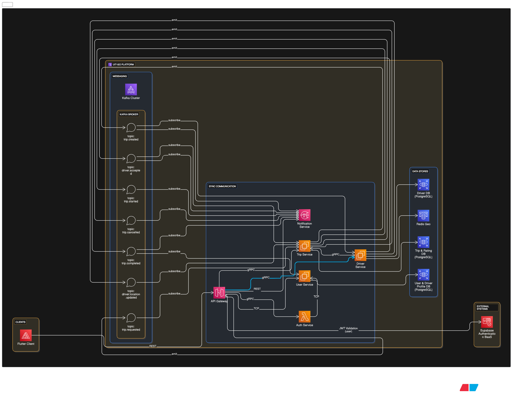

# ARCHITECTURE.md: UIT-Go Cloud-Native System Architecture

## 1. Introduction and Design Philosophy

The UIT-Go backend system is engineered following a **Microservices Cloud-Native** pattern, simulating the role of a **System Engineer** [1]. Our primary objective is to build a platform that is highly scalable, reliable, and secure, while mastering the critical skill of understanding and executing **trade-offs** between cost, performance, and complexity [1, 2].

The team has committed to **Module E: Automation & Cost Optimization (FinOps)** [3], requiring the architecture to inherently support robust self-service deployment and comprehensive financial management on the cloud.

**Key Design Principles:**

*   **Database per Service:** Each service maintains its own data store to ensure independence and scalability [4].
*   **Hybrid Communication:** Combining synchronous (REST/gRPC) and asynchronous (Kafka) methods to optimize latency for critical paths and improve overall resilience [5, 6].
*   **Cloud Agnostic Design:** The system is designed for deployment across multiple locations/clouds, avoiding strong vendor lock-in [Conversation History, 21].
*   **Zero Trust Security:** Relying on **Supabase BaaS** for authentication, with validation enforced at the API Gateway layer [Conversation History, 16].

---

## 2. High-Level System Architecture Diagram

This diagram provides an overview of the six core microservices, the communication methods (sync/async), and the segregated data stores.

### 2.1. System Overview

*(Image exported from draw.eraser.io demonstrating all services, data layers, and communication types.)*

### 2.2. Core Service Overview and Communication Strategy

The system utilizes six decoupled microservices [Conversation History]:

| Service | Primary Responsibility | Data Stores / Technology | Key Communication |
| :--- | :--- | :--- | :--- |
| **API Gateway** | Routing, Rate Limiting, JWT Validation. | N/A | External REST, Internal REST/gRPC |
| **Auth Service** | Handles authentication via **Supabase BaaS**. | Supabase BaaS | Internal REST |
| **User Service** | Manages `user` and `driver-profile` tables [Conversation History, 21]. | PostgreSQL/MySQL (RDS) [7] | Internal REST |
| **Trip Service** | Core logic for managing trips (`trip` and `rating` tables) [7, 8]. | PostgreSQL/MongoDB [8] | Internal REST/gRPC, Async Kafka |
| **Driver Service** | Real-time status, location updates, and nearby driver search [8]. | **Redis Geospatial** [5, 8] | Internal gRPC, Async Kafka |
| **Notification Service**| Sends driver/passenger notifications based on Kafka events. | N/A | Async Kafka |

**Communication Justification:**
*   **Internal Sync:** **gRPC** is selected for the latency-sensitive communication between **Driver Service** and **Trip Service** to achieve high performance [5].
*   **Location Data:** **Redis Geospatial** is chosen for the Driver Service, prioritizing **"Speed-first"** for extremely low-latency lookups necessary for User Story 3 (real-time driver location) [5, 8].
*   **Asynchronous:** **Kafka** is used as the message bus to decouple services (e.g., Trip creation triggering Driver search) [Conversation History]. This fulfills the objective of building a system capable of handling high load (Scalability) [6].

---

## 3. Detailed Architecture for Module E: Automation & FinOps Pipeline

Module E focuses on creating a robust, cost-aware development and operational process. This detailed diagram illustrates how the CI/CD pipeline integrates **Self-Service** capabilities and **Cost Management** steps.

### 3.1. Automation and Cost Optimization Pipeline

*(Image exported from draw.eraser.io illustrating the self-service CI/CD pipeline, reusable Terraform Modules, and integrated cost checks.)*

### 3.2. Module E Implementation Details

Our architecture directly addresses the requirements of Module E [3, 9] through the following automated processes:

1.  **Self-Service Platform:**
    *   **Reusable Terraform Modules:** The underlying infrastructure (VPC, DBs, IAM) is defined using **Terraform** [4]. This code is structured into reusable modules, enabling a developer to safely and quickly deploy a new service instance via the automated CI/CD pipeline (e.g., GitHub Actions) [3].
2.  **Cost Governance & Management:**
    *   **Consistent Tagging:** Resource tagging is enforced during deployment (IaC) to ensure costs can be accurately allocated and analyzed by service or team via AWS Cost Explorer [9].
    *   **AWS Budgets Integration:** Cost management policies are integrated into the IaC definition. **AWS Budgets** are configured to proactively alert the FinOps team when resource consumption threatens to exceed predefined spending limits [9].
3.  **Cost Optimization Decisions:**
    *   The choice of **Redis Geospatial** over alternatives like fully scaling a relational DB is an analyzed and defended optimization choice, reducing cost while boosting performance for a critical, high-volume flow [5, 8, 9].
    *   The architecture supports the future application of other cost-saving measures, such as deploying suitable services onto **Spot Instances** or **Graviton processors**, demonstrating compliance with Module E's optimization mandate [9].
