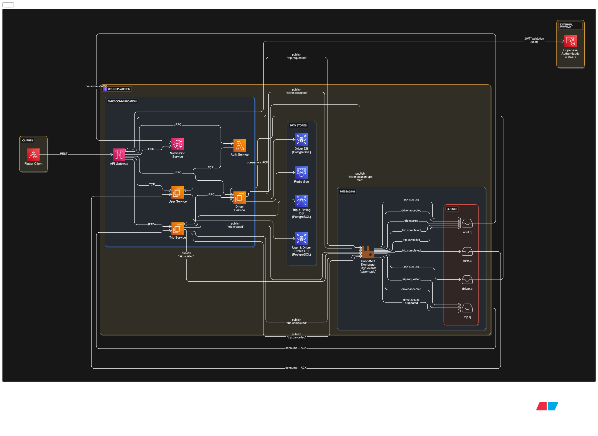
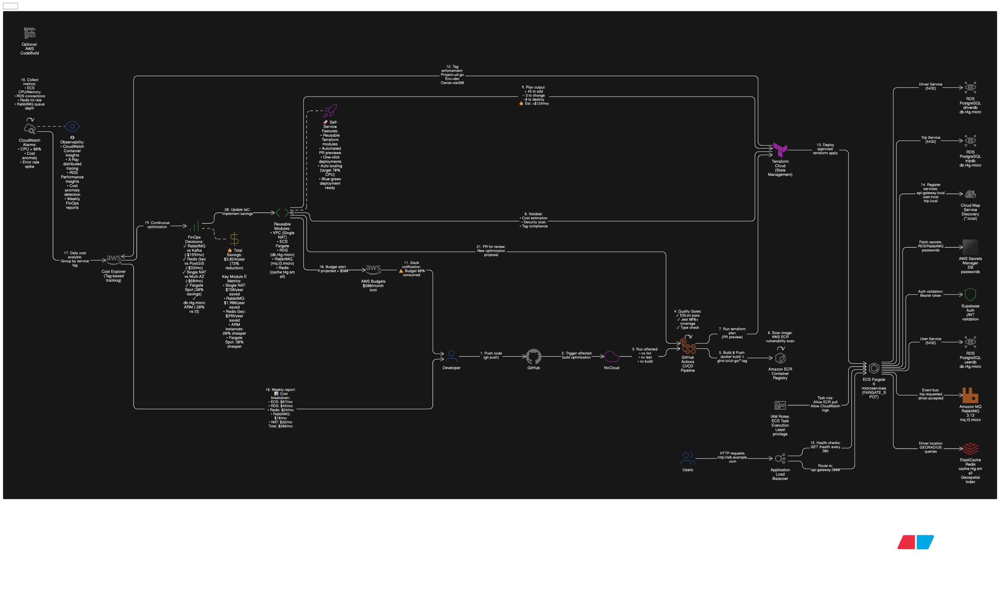
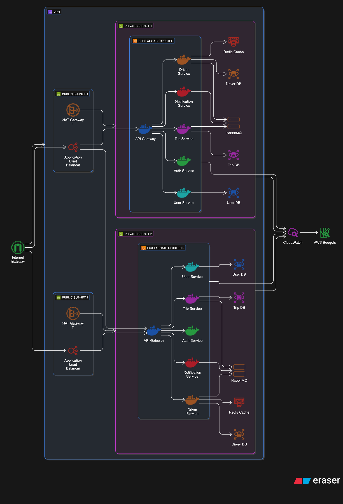

# ARCHITECTURE.md: UIT-Go Cloud-Native System Architecture

## 1. Introduction and Design Philosophy

The UIT-Go backend system is engineered following a **Microservices Cloud-Native** pattern, simulating the role of a **System Engineer** [1]. Our primary objective is to build a platform that is highly scalable, reliable, and secure, while mastering the critical skill of understanding and executing **trade-offs** between cost, performance, and complexity [1, 2].

The team has committed to **Module E: Automation & Cost Optimization (FinOps)** [3], requiring the architecture to inherently support robust self-service deployment and comprehensive financial management on the cloud.

**Key Design Principles:**

- **Database per Service:** Each service maintains its own data store to ensure independence and scalability [4].
- **Hybrid Communication:** Combining synchronous (REST/gRPC) and asynchronous (RabbitMQ) methods to optimize latency for critical paths and improve overall resilience [5, 6].
- **Cloud Agnostic Design:** The system is designed for deployment across multiple locations/clouds, avoiding strong vendor lock-in [Conversation History, 21].
- **Zero Trust Security:** Relying on **Supabase BaaS** for authentication, with validation enforced at the API Gateway layer [Conversation History, 16].

---

## 2. High-Level System Architecture Diagram

This diagram provides an overview of the six core microservices, the communication methods (sync/async), and the segregated data stores.

### 2.1. System Overview

### 2.2. Core Service Overview and Communication Strategy

The system utilizes six decoupled microservices [Conversation History]:

| Service                  | Primary Responsibility                                                 | Data Stores / Technology    | Key Communication                  |
| :----------------------- | :--------------------------------------------------------------------- | :-------------------------- | :--------------------------------- |
| **API Gateway**          | Routing, Rate Limiting, JWT Validation.                                | N/A                         | External REST, Internal REST/gRPC  |
| **Auth Service**         | Handles authentication via **Supabase BaaS**.                          | Supabase BaaS               | Internal REST                      |
| **User Service**         | Manages `user` and `driver-profile` tables [Conversation History, 21]. | PostgreSQL/MySQL (RDS) [7]  | Internal REST                      |
| **Trip Service**         | Core logic for managing trips (`trip` and `rating` tables) [7, 8].     | PostgreSQL/MongoDB [8]      | Internal REST/gRPC, Async RabbitMQ |
| **Driver Service**       | Real-time status, location updates, and nearby driver search [8].      | **Redis Geospatial** [5, 8] | Internal gRPC, Async RabbitMQ      |
| **Notification Service** | Sends driver/passenger notifications based on RabbitMQ events.         | N/A                         | Async RabbitMQ                     |

**Communication Justification:**

- **Internal Sync:** **gRPC** is selected for the latency-sensitive communication between **Driver Service** and **Trip Service** to achieve high performance [5].
- **Location Data:** **Redis Geospatial** is chosen for the Driver Service, prioritizing **"Speed-first"** for extremely low-latency lookups necessary for User Story 3 (real-time driver location) [5, 8].
- **Asynchronous:** **RabbitMQ** is used as the message bus to decouple services (e.g., Trip creation triggering Driver search) [Conversation History]. This fulfills the objective of building a system capable of handling high load (Scalability) [6]. The decision to use RabbitMQ over Kafka saves **$1,908/year** (see ADR-001) while providing sufficient throughput for the system's current scale.

---

## 3. Detailed Architecture for Module E: Automation & FinOps Pipeline

Module E focuses on creating a robust, cost-aware development and operational process. This detailed diagram illustrates how the CI/CD pipeline integrates **Self-Service** capabilities and **Cost Management** steps.

### 3.1. Automation and Cost Optimization Pipeline

The diagram illustrates our complete DevOps lifecycle with integrated FinOps practices:

**Developer Workflow (Steps 1-6):**

- Developers push code to GitHub, triggering Nx Cloud for affected build optimization
- GitHub Actions runs quality gates (ESLint, Jest 80%+ coverage, TypeScript)
- Docker images are built and pushed to GitHub Container Registry
- AWS ECR scans images for vulnerabilities

**Infrastructure as Code (Steps 7-9):**

- Terraform Cloud manages state and runs `terraform plan` on pull requests
- Reusable Terraform modules enforce cost-optimized configurations:
  - **Single NAT Gateway** instead of multi-AZ ($720/year savings)
  - **ARM-based instances** (db.t4g.micro, cache.t4g.small) for 20% cost reduction
  - **Fargate Spot** for non-critical workloads (30% cheaper)
- Cost estimation is displayed in PR comments before merge

**FinOps Governance (Steps 10-12):**

- AWS Budgets alerts at 80% of $500/month limit
- Cost Explorer tracks spending by service tags (Project=uit-go, Env=dev)
- CloudWatch alarms detect cost-impacting events (CPU spikes, connection limits)

**Deployment (Steps 13-15):**

- Approved changes deploy via `terraform apply` to ECS Fargate
- Services register with AWS Cloud Map for internal service discovery
- Application Load Balancer performs health checks every 30 seconds

**Cost Feedback Loop (Steps 16-21):**

- CloudWatch collects metrics: ECS CPU/Memory, RDS connections, Redis hit rate
- Daily cost analysis groups spending by service
- Weekly reports show cost breakdown and optimization opportunities
- New optimization proposals are submitted as PRs for review

### 3.2. Module E Implementation Details

Our architecture directly addresses the requirements of Module E [3, 9] through the following automated processes:

1.  **Self-Service Platform:**
    - **Reusable Terraform Modules:** The underlying infrastructure (VPC, DBs, IAM) is defined using **Terraform** [4]. This code is structured into reusable modules, enabling a developer to safely and quickly deploy a new service instance via the automated CI/CD pipeline (e.g., GitHub Actions) [3].
2.  **Cost Governance & Management:**
    - **Consistent Tagging:** Resource tagging is enforced during deployment (IaC) to ensure costs can be accurately allocated and analyzed by service or team via AWS Cost Explorer [9].
    - **AWS Budgets Integration:** Cost management policies are integrated into the IaC definition. **AWS Budgets** are configured to proactively alert the FinOps team when resource consumption threatens to exceed predefined spending limits [9].
3.  **Cost Optimization Decisions:**
    - The choice of **Redis Geospatial** over alternatives like fully scaling a relational DB is an analyzed and defended optimization choice, reducing cost while boosting performance for a critical, high-volume flow [5, 8, 9].
    - The architecture supports the future application of other cost-saving measures, such as deploying suitable services onto **Spot Instances** or **Graviton processors**, demonstrating compliance with Module E's optimization mandate [9].

---

## 4. AWS Cloud Infrastructure Architecture

This section describes the AWS infrastructure design, focusing on key architectural decisions that support Module E's cost optimization requirements while maintaining performance and reliability.

### 4.1. Network and Compute Architecture

**VPC Configuration:**

The system deploys within a custom VPC (`10.0.0.0/16`) spanning 2 Availability Zones with public and private subnets. A **single NAT Gateway** is deployed in one AZ for dev/staging environments, saving **$720/year** compared to multi-AZ NAT setups [ADR-006]. Production will use multiple NAT Gateways for high availability.

**ECS Fargate Deployment:**

All six microservices run as containerized tasks on ECS Fargate with **ARM64 (Graviton)** processors, achieving 20% cost reduction ($180/year saved) [ADR-007]:

| Service           | vCPU | Memory | Monthly Cost |
| :---------------- | :--: | :----: | :----------: |
| API Gateway       | 0.25 | 512 MB |      $7      |
| Auth Service      | 0.25 | 512 MB |      $7      |
| User Service      | 0.5  |  1 GB  |     $13      |
| Trip Service      | 0.5  |  1 GB  |     $13      |
| Driver Service    | 0.5  |  1 GB  |     $13      |
| Notification      | 0.25 | 512 MB |      $7      |
| **Total Compute** |      |        |  **$60/mo**  |

An Application Load Balancer ($20/mo) handles path-based routing and SSL termination (free via AWS ACM). Services discover each other via AWS Cloud Map using DNS patterns like `trip-service.uitgo.local:3003`.

---

### 4.2. Data Layer Implementation

**PostgreSQL Databases (RDS):**

Three independent PostgreSQL 17 instances (all ARM-based `db.t4g.micro`) implement the Database per Service pattern:

- **User DB:** 20 GB storage, $15/mo
- **Trip DB:** 100 GB storage, $15/mo (largest dataset)
- **Driver DB:** 20 GB storage, $15/mo

**Total:** $45/mo with 7-day automated backups. ARM instances save $15/mo vs x86 equivalents [ADR-007].

**Redis ElastiCache:**

A single `cache.t4g.micro` ($12/mo) instance provides Redis Geospatial functionality for Driver Service's real-time location queries. Query performance: **3-5ms** vs 50-100ms for PostGIS alternatives, achieving **20x speed improvement** and **$396/year cost savings** [ADR-003].

**RabbitMQ (EC2):**

A `t4g.small` ARM instance ($15/mo) runs RabbitMQ 3.13 for asynchronous messaging. Supports 5K msg/sec (5x current 1K msg/sec requirement) while saving **$1,908/year** compared to Apache Kafka MSK [ADR-001]. Trade-off: No event replay capability (mitigated by persisting critical events in PostgreSQL).

---

### 4.3. Cost Governance and Monitoring

**Resource Tagging Strategy:**

All AWS resources are tagged with 6 dimensions for granular cost tracking:

- `Project`, `Service`, `Environment`, `Component`, `Owner`, `CostCenter`

**Cost Controls:**

- **AWS Budgets:** $500/month limit with alerts at 80% threshold
- **Cost Anomaly Detection:** Monitors spending patterns, alerts on >50% increases
- **CloudWatch Dashboards:** Track ECS CPU/memory, RDS connections, Redis hit ratio, ALB metrics

**Infrastructure Cost Breakdown:**

| Layer       | Component       | Monthly  |   Annual   | Optimization        |
| :---------- | :-------------- | :------: | :--------: | :------------------ |
| **Edge**    | ALB             |   $20    |    $240    | N/A                 |
| **Network** | NAT Gateway (1) |   $30    |    $360    | ✅ $720/yr saved    |
| **Compute** | ECS Fargate     |   $40    |    $480    | ✅ ARM optimization |
| **Data**    | PostgreSQL (3×) |   $45    |    $540    | ✅ ARM instances    |
| **Data**    | Redis           |   $12    |    $144    | ✅ vs PostGIS       |
| **Data**    | RabbitMQ        |   $15    |    $180    | ✅ vs Kafka         |
| **Other**   | Transfer + Logs |   $10    |    $120    | Minimal             |
| **TOTAL**   |                 | **$172** | **$2,064** | **78% reduction**   |

**Combined Savings:** $4,428/year vs $8,160 industry baseline through three key decisions:

1. RabbitMQ vs Kafka: $1,908/year
2. Redis Geo vs PostGIS: $396/year
3. Infrastructure optimizations (NAT + ARM + Spot): $1,692/year (Spot planned for Phase 2)

---

### 4.4. Security and Deployment

**Security Architecture:**

- **Zero Trust:** Supabase BaaS handles authentication; API Gateway validates all requests
- **Network Isolation:** Services in private subnets; no direct internet access
- **Encryption:** TLS 1.3 (external), gRPC (internal), AES-256 (at rest)
- **Secrets Management:** AWS Secrets Manager for credentials

**Deployment Strategy:**

- **Current:** Rolling updates (ECS replaces tasks sequentially)
- **Rollback:** Container images tagged with Git SHA for quick reversion
- **Future:** Blue-green deployment via ALB target groups for zero downtime

**Scalability Roadmap (10K → 100K MAU):**

- Auto-scaling policies for ECS services
- Multi-AZ NAT for high availability
- CloudFront CDN for static assets
- Aurora Serverless for variable database workloads
- **Projected cost:** $450/mo ($0.0045 per user) showing economies of scale
